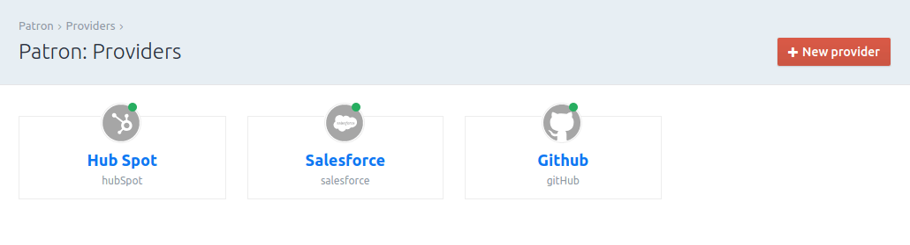
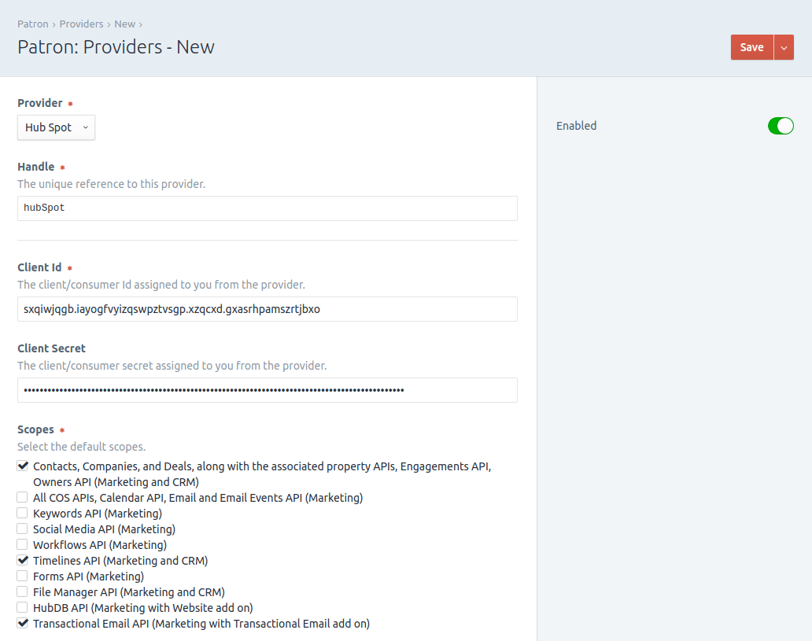
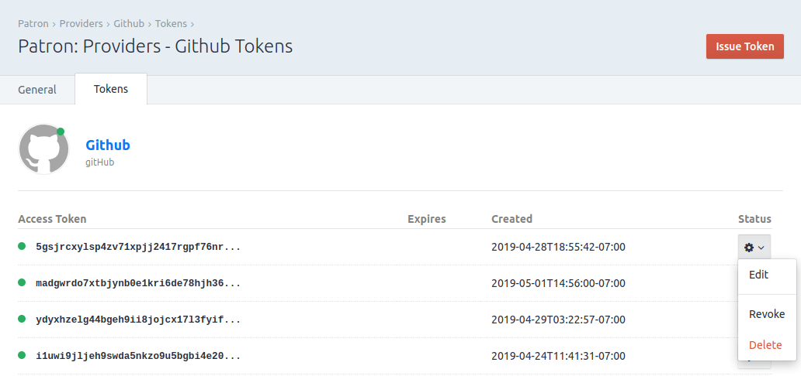
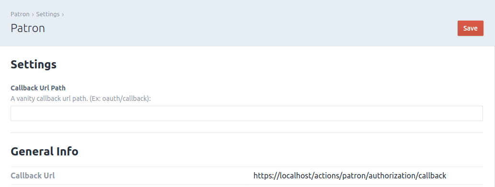

# An OAuth2 client manager for Craft CMS
[](https://gitter.im/flipboxfactory/patron?utm_source=badge&utm_medium=badge&utm_campaign=pr-badge&utm_content=badge)
[](https://github.com/flipboxfactory/patron/releases)
[](LICENSE.md)
[](https://travis-ci.org/flipboxfactory/patron)
[](https://scrutinizer-ci.com/g/flipboxfactory/patron/code-structure)
[](https://scrutinizer-ci.com/g/flipboxfactory/patron)
[](https://packagist.org/packages/flipboxfactory/patron)

Patron is an OAuth2 client manager; Providing an easy to use interface for managing OAuth2 providers and tokens.



## Requirements
This plugin requires Craft CMS 3.0 or later.

## Installation
Choose one of the following ways to add [Patron] to your project:

1. Composer:

    Simply run the following command from your project root:

    ```
    composer require flipboxfactory/patron
    ```

2. Craft CMS Plugin Store:

    Within your Craft CMS project admin panel, navigate to the '[Plugin Store]' and search for '[Patron]'. Installation is a button click away.


Once the plugin is included in your project, navigate to the Control Panel, go to Settings → Plugins and click the “Install” button for [Patron].

## Features
[Patron] provides an admin interface for [The PHP League's OAuth2 client package](https://oauth2-client.thephpleague.com/).
a field precisely to their requirements.

Here are some of the features at a glance:
* [Project Config compatible](https://docs.craftcms.com/v3/project-config.html)
* [Provider locking](#provider-locking) (for plugin developers)
* Native providers: Facebook, GitHub, Google, LinkedIn, Instagram
* [Register your own OAuth2 Providers](#third-party-providers)

### Templating
The `craft.patron` template variable provides access to the entire [Patron] plugin.  However, there are two useful tags 
 worth highlighting:

Retrieving providers:
```twig


```

Retrieving tokens:
```twig

 {# a token associated to a provider #}
```

### Screenshots








### Third Party Providers
Adding addition providers to [Patron] is handled through the following events:

1. Register a compatible [The PHP League OAuth2 provider](https://oauth2-client.thephpleague.com/providers/implementing/) using a [fully qualified class name](https://php.net/manual/en/language.oop5.basic.php#language.oop5.basic.class.class).  The PHP League has a [helpful list](https://oauth2-client.thephpleague.com/providers/thirdparty/) that have been contributed by the community.
    ```php
    \yii\base\Event::on(
        \flipbox\patron\cp\Cp::class,
        \flipbox\patron\events\RegisterProviders::REGISTER_PROVIDERS,
        function (\flipbox\patron\events\RegisterProviders $event) {
            $event->providers[] = '\your\fully\qualified\provider\class\name'; // Ex: \Stevenmaguire\OAuth2\Client\Provider\Salesforce::class
        }
    );
    ```
    
2. \[Optional\] Register a settings interface for the Provider.  If your provider can be configured, the settings interface will enable configuration inputs via the Craft CP.  The settings interface will be registered on the same provider class in step 1.
    ```php
    \yii\base\Event::on(
        '\your\fully\qualified\provider\class\name', // Ex: \Stevenmaguire\OAuth2\Client\Provider\Salesforce::class
        \flipbox\patron\events\RegisterProviderSettings::REGISTER_SETTINGS,
        function (\flipbox\patron\events\RegisterProviderSettings $event) {
            $event->class = '\your\fully\qualified\settings\class\name';  // Ex: \flipbox\patron\salesforce\settings\SalesforceSettings::class
        }
    );
    ```

3. \[Optional\] Register additional info for the Provider.  Throughout the Craft CP we use a provider `name` and `icon`.  Register the following in order to specify these values: 
    ```php
    
    \yii\base\Event::on(
        \flipbox\patron\cp\Cp::class,
        \flipbox\patron\events\RegisterProviderInfo::REGISTER_INFO,
        function (\flipbox\patron\events\RegisterProviderInfo $event) {
            $event->info['\your\fully\qualified\provider\class\name] = [
                'name' => 'Your Provider', 
                'icon' => '/path/to/icon.svg' // Ex: '@vendor/flipboxfactory/patron-salesforce/icons/salesforce.svg'
            ];
        }
    );
    
    ```

As an example, here are a few third-party provider packages to reference:
* [Salesforce OAuth2 Provider for Patron](https://github.com/flipboxfactory/patron-salesforce)
* [HubSpot OAuth2 Provider for Patron](https://github.com/flipboxfactory/patron-hubspot)


### Provider Locking
A provider can be 'locked' by a plugin.  As a result, only the plugin (that locked it) can delete the provider.  This is useful when another plugin 
is using [Patron] to manage it's OAuth2 connections, which may not be apparent.

    ```php
    
    /** @var \flipbox\patron\records\Provider $provider */
    /** @var \craft\base\PluginInterface $yourPlugin */
    

    $provider->saveAndLock($yourPlugin);
    
    ```

## Contributing

Please see [CONTRIBUTING](https://github.com/flipboxfactory/patron/blob/master/CONTRIBUTING.md) for details.


## Credits

- [Flipbox Digital](https://github.com/flipbox)

## License

The MIT License (MIT). Please see [License File](https://github.com/flipboxfactory/patron/blob/master/LICENSE) for more information.

[Plugin Store]: https://plugins.craftcms.com/patron
[Patron]: https://plugins.craftcms.com/patron