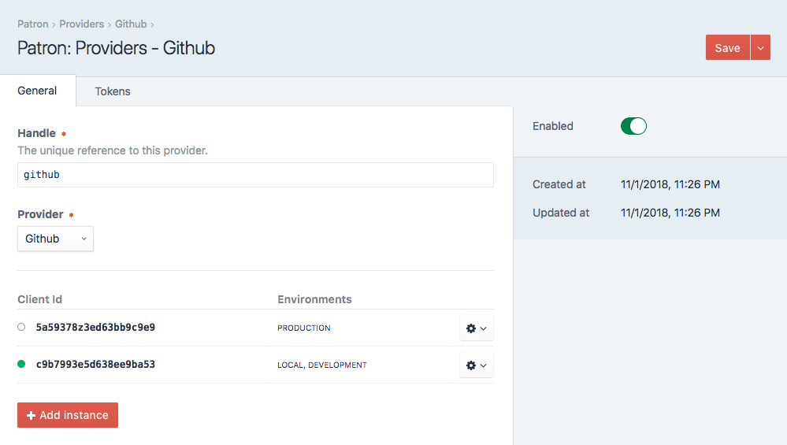

# Configure Provider

Configuring a provider is typically the first step when establishing a connection to a third-party (such as Google or GitHub, etc).  
The process is quite simple and straight forward.  Here are some guidelines:

### `Handle`
A unique identifier for the provider.  This handle is used to reference the provider via the API.

### `Enabled`
Identifies whether the provider is considered 'available for use' by default.

### Instances
Provider Instances enable unique configurations on a per-environment basis.  A CRM integration, for example, may result
in a 'test' and 'production' instances.  References to the Provider remain the same, but each environment connects to the appropriate 
application.